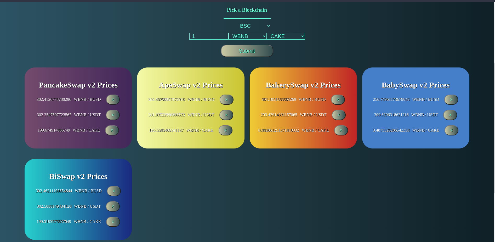
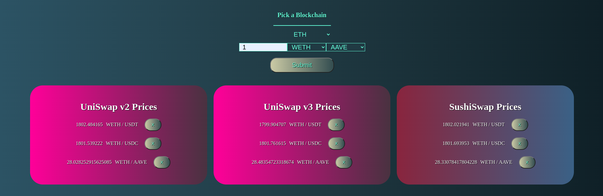

This is a Web3 app that fetches cryptocurrency price data across 
different decentralized exchanges (mostly based on the UniswapV2 
platform) and different blockchains.

Once fetched the price & cryptocurrency pair data is displayed 
along with from what exchange the price data came from.

A user can input their own trading pairs and see what those 
prices would be across different exchanges.

The data fetched would help users find arbitrage opportunities.

I decided to try something different in the architecture of this app.

I have 1 react client that fetches data from multiple node.js servers
(localhost:5000 - 5003, more servers to be added soon). I've started
the process of dockerizing, but I still have more to learn about
Docker compose. For right meow, I'm starting each localhost server 
separately.

Each server fetches token prices from a different blockchain and
different platform (UniswapV2 or V3).

The screenshot above is fetching token prices from 5 different BSC
DEXs all with a single call (in this case BakerySwap & BabySwap both
seem to have low liquidity for the WBNB / CAKE token pair). 

The screenshot below shows token pair data across 3 DEXs on the 
ethereum network.

